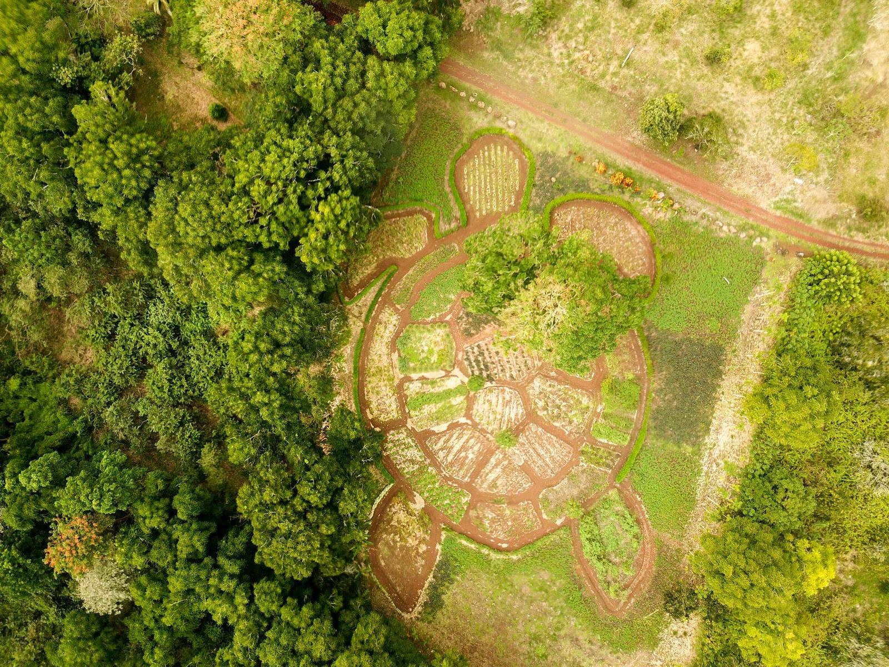
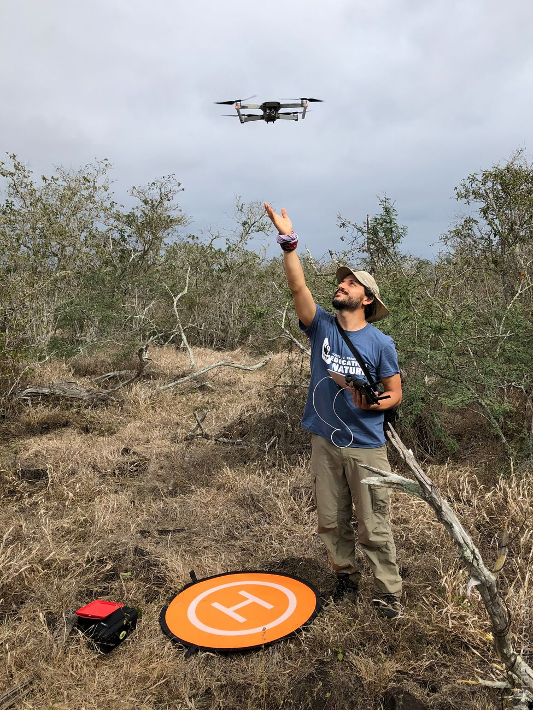
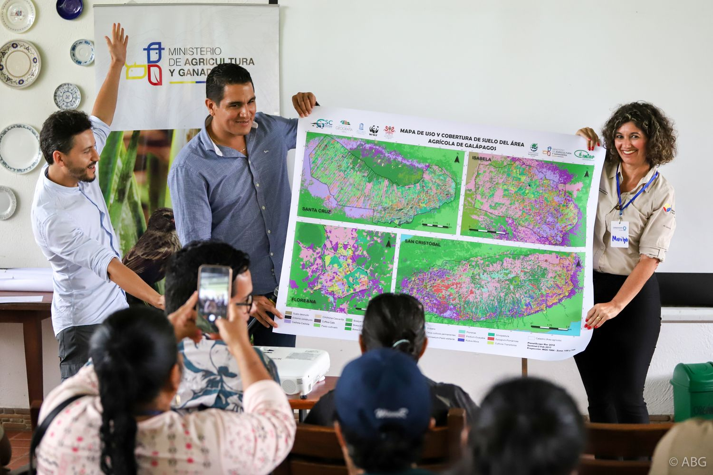
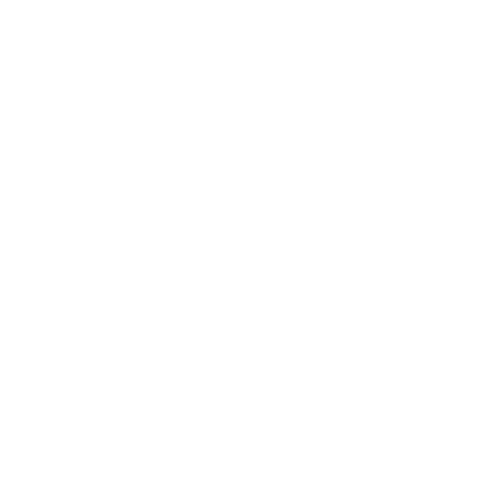

::: {.wrap}
::: {.hero}
::: {.hero-text}
[Environmental Studies · Western Washington University]{.eyebrow}

# Mapping what maps leave out.

[LASO Lab uses remote sensing, GIS and participatory mapping to bring into view the species living on farms, farmers' own knowledge, and the barriers disabled people meet every day — working with the people concerned, on their terms.]{.lead-text}

::: {.btn-row}
[See our research](research.qmd){.btn-olive}
[Prospective students](join.qmd){.btn-ghost}
:::
:::

```{=html}
<div class="hero-tiles">
  <figure class="tile">
    
    <figcaption class="chip">Landscape</figcaption>
  </figure>
  <figure class="tile">
    
    <figcaption class="chip">Accessibility</figcaption>
  </figure>
  <figure class="tile">
    
    <figcaption class="chip">Spatial observation</figcaption>
  </figure>
</div>
```
:::
:::

::: {.band}
::: {.wrap .sec}
## What we study

[Three threads, one in each letter of our name.]{.muted}

::: {.themes}
::: {.theme}
[L]{.letter}

### Landscape

How farming and conservation share land — land-cover change, invasive species and agroecosystems, with a long-running focus on the Galápagos highlands and mainland Ecuador.
:::

::: {.theme}
[A]{.letter}

### Accessibility

Mapping barriers, and barrier-free routes, together with disabled people — so maps reflect lived experience, not just building plans.
:::

::: {.theme}
[SO]{.letter}

### Spatial observation

The tools behind both: satellites, radar, drones, LiDAR and field data, processed in Google Earth Engine, R and GIS — and shared as open, bilingual tools.
:::
:::
:::
:::

::: {.wrap .sec}
## Projects

```{=html}
<div class="cards">
  <article class="card-proj">
    
    <div class="body">
      <p class="eyebrow" style="margin:0">Landscape · Spatial observation</p>
      <h3>Galapagos Agroecological Observatory</h3>
      <p>A long-term observatory of the farming highlands of four inhabited islands, built with farmer families, USFQ, Heifer Ecuador and local partners: satellites and radar above the garúa, drones and field sampling below it.</p>
      <div class="links">
        <a href="research.qmd#galapagos-agroecological-observatory">Read more</a>
        <a href="https://www.observatoriogalapagos.org">Observatory website</a>
        <a href="https://galapagosobservatory.users.earthengine.app/view/galapagos-agroecosystem-explorer">Explorer map app</a>
      </div>
    </div>
  </article>
  <article class="card-proj">
    <div class="pair">
      
      
    </div>
    <div class="body">
      <p class="eyebrow" style="margin:0">Accessibility · Spatial observation</p>
      <h3>Mapping Accessibility Project</h3>
      <p>Participatory mapping of the WWU campus and the Sehome Hill Arboretum. Student teams audit entrances, automatic doors, sensory spaces and trail slopes, and write plain-text routes for screen-reader users.</p>
      <div class="links">
        <a href="research.qmd#mapping-accessibility-project">Read more</a>
      </div>
    </div>
  </article>
</div>
```
:::

::: {.wrap}
```{=html}
<div class="callout-join">
  
  <div class="txt">
    <h2>Join the lab</h2>
    <p>We are recruiting a funded M.A. student in Environmental Studies for Fall 2027, in one of two tracks — the Galápagos and Ecuador, or accessibility and participatory mapping — or with your own spatial question. Undergraduates are welcome year-round.</p>
  </div>
  <a class="btn-olive" href="join.qmd">See openings</a>
</div>
```
:::

::: {.wrap .sec}
## Selected publications

::: {.pub-list}
- [2026 · Agricultural Systems]{.pub-meta}\
  [Trajectories of farming systems reshape land use/land cover dynamics in the agricultural zones of the Galapagos Islands]{.pub-title}\
  [Benítez, F. L., Mena, C. F., **Laso, F. J.**, Zapata, M. B., Rivas-Torres, G., & Gobin, A.]{.pub-authors}\
  <https://doi.org/10.1016/j.agsy.2025.104506>
- [2020 · Drones]{.pub-meta}\
  [Drone-based participatory mapping: examining local agricultural knowledge in the Galapagos]{.pub-title}\
  [Colloredo-Mansfeld, M., **Laso, F. J.**, & Arce-Nazario, J.]{.pub-authors}\
  <https://doi.org/10.3390/drones4040062>
- [2020 · Remote Sensing]{.pub-meta}\
  [Land cover classification of complex agroecosystems in the non-protected highlands of the Galapagos Islands]{.pub-title}\
  [**Laso, F. J.**, Benítez, F. L., Rivas-Torres, G., Sampedro, C., & Arce-Nazario, J.]{.pub-authors}\
  <https://doi.org/10.3390/rs12010065>
:::

[All publications →](publications.qmd)
:::
