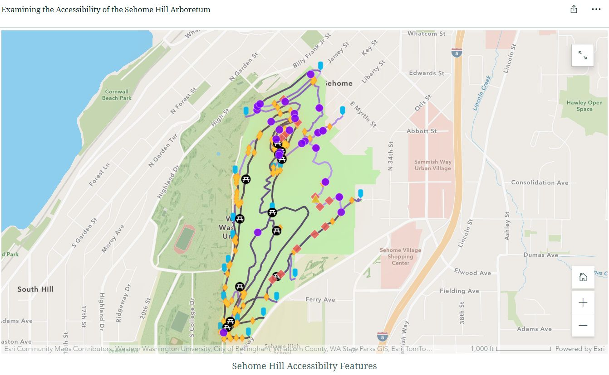
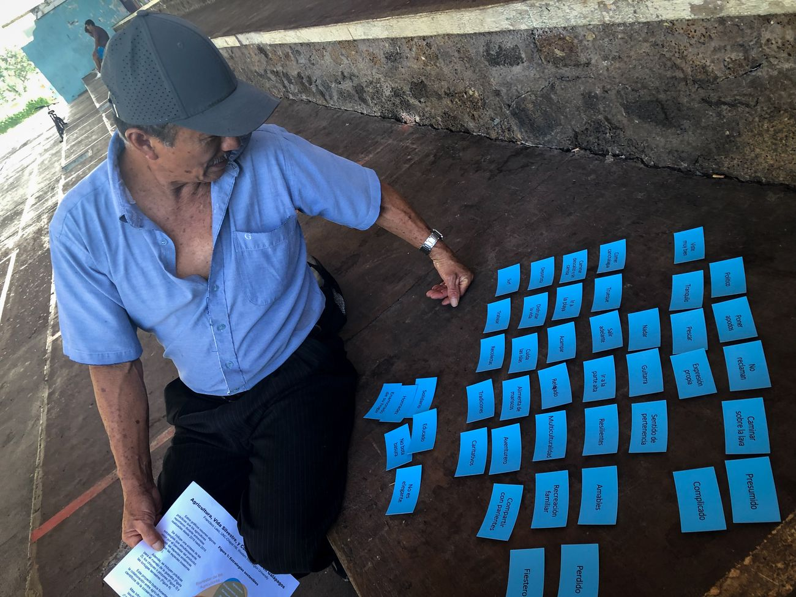

LASO Lab welcomes students who want to use maps, satellites, drones and field data to work on real problems with real partners. We care more about curiosity, follow-through and respect for the communities we work with than about any particular software — the technical skills we can teach.

## M.A. student, Fall 2027 {#ma}

::: {.panel-tabset}

### English

**Mapping what maps leave out**\
Funded M.A. in Environmental Studies · Western Washington University

Dr. Francisco Laso is looking for a master's student to join the [Environmental Studies (ENVS) M.A. program](https://cenv.wwu.edu/envs/ma-environmental-studies) in Fall 2027.

LASO Lab brings into view what official maps tend to miss — the species living on farms, farmers' own knowledge, the barriers disabled people meet every day. Putting something on the map acknowledges that it exists: a first step toward recognition, and toward people exercising their agency where other views dominate. We do this with the people concerned, on their terms. You can join one of two ongoing tracks — or bring your own question.

#### Track A — Galápagos and Ecuador

Agriculture, conservation and land change in the Galápagos highlands or mainland Ecuador, with the [Galapagos Agroecological Observatory](research.qmd#galapagos-agroecological-observatory) and partners in Ecuador. Possible projects: land-cover change monitoring in Google Earth Engine, farmer knowledge and participatory mapping, environmental justice and land systems, or bilingual open-data tools.\
*Spanish is strongly preferred for this track*, because much of the work happens directly with farmers and partners in Ecuador.

#### Track B — Accessibility and participatory mapping

Mapping barriers, and barrier-free routes, together with disabled people on the WWU campus, in the Sehome Hill Arboretum and in Bellingham, building on the [Mapping Accessibility Project](research.qmd#mapping-accessibility-project). Possible projects: accessible routing and plain-text maps for screen-reader users, sensory spaces, trail and slope mapping with multispectral drones and elevation data (including LiDAR-derived terrain), or how institutions use (and ignore) accessibility data.\
No Spanish needed, and partners on campus are already in place.

#### Or propose your own

If you have a question about what — or who — is missing from the map, and it fits the lab, we want to hear it.

#### What you would gain

- **Funding** through a Teaching Assistantship, usually in the courses closest to your skills: the GIS sequence, Introduction to Remote Sensing, Introduction to Research Methods, or Understanding and Communicating Environmental Data and Information.
- **Skills** in GIS, remote sensing, Google Earth Engine, R, drone mapping and participatory methods.
- **Real partners and real outputs:** co-authored work, open-data tools and public-facing communication.
- **Mentoring** that follows your goals, whether that's a Ph.D., government, non-profit or industry work.

#### What we look for

**Essential**

- Curiosity about spatial questions and the people behind them.
- Follow-through: you finish what you start, and say so when you're stuck.
- Clear writing, or a strong wish to get better at it.
- Care and respect when working with communities and partners.

**Helpful, but we can teach it**

- Coursework or experience in GIS, remote sensing or geography.
- Some coding in R, Python or Google Earth Engine.
- Spanish (strongly preferred for Track A).

If you meet some of these and are excited by the work, please get in touch — you don't need to tick every box.

#### How to get in touch — two steps

1. **Say hello — by January 10, 2027.** Email [lasof@wwu.edu](mailto:lasof@wwu.edu?subject=M.A.%20inquiry%20—%20LASO%20Lab) with:
   - your CV, and
   - a few paragraphs on which track (or your own idea) interests you, why, and what you would like to learn.
   - *Optional:* a link to a map, project or code you're proud of.

   We'll then set up a short video call to talk it through.
2. **Apply — by February 1, 2027.** If it's a good fit, you submit the formal application (statement, writing sample, transcripts and references) to the [WWU Graduate School](https://gradschool.wwu.edu/environmental-studies) by the February 1 priority deadline for admission and TA funding.

**International applicants are welcome.** Please write early, as funding works differently for international students and we'll want to talk it through together.

[Email Francisco](mailto:lasof@wwu.edu?subject=M.A.%20inquiry%20—%20LASO%20Lab){.btn-olive}

### Español

**Mapear lo que los mapas dejan fuera**\
Maestría (M.A.) financiada en Estudios Ambientales · Western Washington University

El Dr. Francisco Laso busca un/a estudiante de maestría para unirse al [programa de M.A. en Estudios Ambientales (ENVS)](https://cenv.wwu.edu/envs/ma-environmental-studies) en otoño de 2027.

LASO Lab hace visible lo que los mapas oficiales suelen pasar por alto: las especies que viven en las fincas, el conocimiento de los propios agricultores, las barreras que enfrentan a diario las personas con discapacidad. Poner algo en el mapa es reconocer que existe: un primer paso hacia su reconocimiento, y hacia que las personas ejerzan su agencia frente a visiones dominantes. Lo hacemos con las personas involucradas, en sus propios términos. Puedes sumarte a una de dos líneas en curso — o traer tu propia pregunta.

#### Línea A — Galápagos y Ecuador

Agricultura, conservación y cambio del paisaje en la zona alta de Galápagos o en el Ecuador continental, con el [Observatorio Agroecológico de Galápagos](research.qmd#galapagos-agroecological-observatory) y socios en Ecuador. Posibles proyectos: monitoreo del cambio de cobertura del suelo en Google Earth Engine, conocimiento campesino y mapeo participativo, justicia ambiental y sistemas de uso del suelo, o herramientas de datos abiertos bilingües.\
*Para esta línea se valora mucho el español*, porque gran parte del trabajo se hace directamente con agricultores y socios en Ecuador.

#### Línea B — Accesibilidad y mapeo participativo

Mapear barreras, y rutas sin barreras, junto con personas con discapacidad en el campus de WWU, el Arboreto de Sehome Hill y Bellingham, a partir del [Mapping Accessibility Project](research.qmd#mapping-accessibility-project). Posibles proyectos: rutas accesibles y mapas en texto para lectores de pantalla, espacios sensoriales, mapeo de senderos y pendientes con drones multiespectrales y datos de elevación (incluido terreno derivado de LiDAR), o cómo las instituciones usan (o ignoran) los datos de accesibilidad.\
No requiere español, y los socios en el campus ya están en marcha.

#### O propón tu propio proyecto

Si tienes una pregunta sobre qué — o quién — falta en el mapa, y encaja en el laboratorio, queremos escucharla.

#### Qué ganarías

- **Financiamiento** mediante una Asistencia de Docencia (TA), normalmente en los cursos más cercanos a tus habilidades: la secuencia de SIG, Introducción a la Teledetección, Introducción a los Métodos de Investigación, o Comprensión y Comunicación de Datos Ambientales.
- **Habilidades** en SIG, teledetección, Google Earth Engine, R, mapeo con drones y métodos participativos.
- **Socios y resultados reales:** publicaciones en coautoría, herramientas de datos abiertos y comunicación con el público.
- **Mentoría** según tus metas: doctorado, sector público, ONG o empresa.

#### Qué buscamos

**Esencial**

- Curiosidad por las preguntas espaciales y por las personas detrás de ellas.
- Constancia: terminas lo que empiezas y avisas cuando te atascas.
- Escritura clara, o muchas ganas de mejorarla.
- Cuidado y respeto al trabajar con comunidades y socios.

**Útil, pero se puede aprender**

- Cursos o experiencia en SIG, teledetección o geografía.
- Algo de programación en R, Python o Google Earth Engine.
- Español (muy valorado para la Línea A).

Si cumples algunos de estos puntos y el trabajo te entusiasma, escríbenos: no necesitas cumplir con todo. Los cursos del programa se dictan en inglés.

#### Cómo contactarnos — dos pasos

1. **Preséntate — hasta el 10 de enero de 2027.** Escribe a [lasof@wwu.edu](mailto:lasof@wwu.edu?subject=Consulta%20M.A.%20—%20LASO%20Lab) con:
   - tu CV, y
   - unos párrafos sobre qué línea (o qué idea propia) te interesa, por qué, y qué te gustaría aprender.
   - *Opcional:* un enlace a un mapa, proyecto o código del que estés orgulloso/a.

   Luego coordinamos una videollamada corta para conversar.
2. **Postula — hasta el 1 de febrero de 2027.** Si hay buena afinidad, envías la postulación formal (carta de motivación, muestra de escritura, certificados de notas y referencias) a la [Escuela de Posgrado de WWU](https://gradschool.wwu.edu/environmental-studies) antes de esa fecha prioritaria para admisión y financiamiento.

**Recibimos postulantes internacionales.** Escríbenos con tiempo: el financiamiento funciona de otra manera para estudiantes internacionales y conviene conversarlo juntos.

[Escribir a Francisco](mailto:lasof@wwu.edu?subject=Consulta%20M.A.%20—%20LASO%20Lab){.btn-olive}

:::

## Undergraduates {#undergraduates}

Most undergraduate research in the lab happens through the **Mapping Accessibility Project** and through applied GIS courses, where student teams map real problems on campus with partners such as the Disability Outreach Center. Ways to get involved:

- **Team projects in GIS IV (ENVS 421)** that feed directly into the Mapping Accessibility Project.
- **Senior projects** in Environmental Studies on accessibility, spatial analysis or environmental decision-making.
- **Independent research** on remote sensing or drone mapping, including work connected to the Galápagos observatory.

No prior GIS experience is needed to start a conversation. Email [lasof@wwu.edu](mailto:lasof@wwu.edu?subject=Undergraduate%20research%20—%20LASO%20Lab) with your year and major, what interests you, and any courses or skills you already have.

::: {.figure-row}
{fig-alt="Community members adding notes to a printed campus accessibility map"}

{fig-alt="Web map of accessibility features along trails in the Sehome Hill Arboretum"}

{fig-alt="A farmer arranging blue cards during a pile-sort interview in the Galápagos"}
:::
