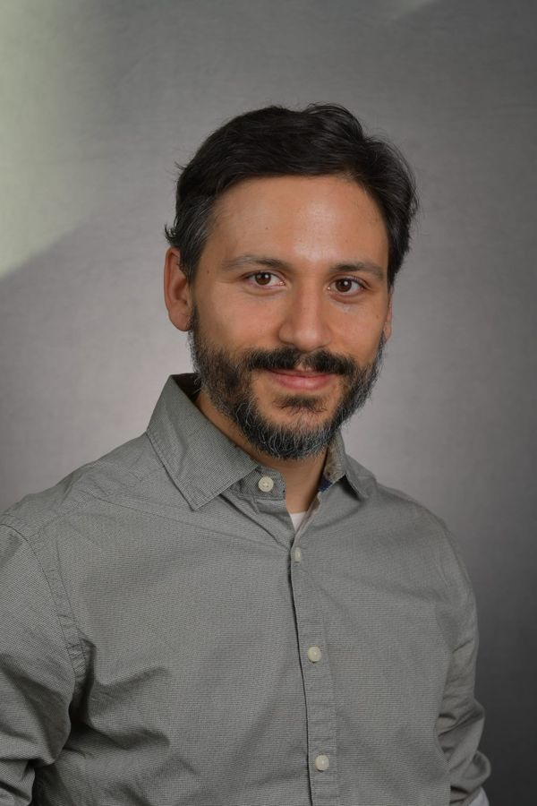

## Principal investigator

```{=html}
<div class="person">
  
  <div class="about">
    <h3 style="margin-top:0">Francisco Laso, Ph.D.</h3>
    <p class="muted" style="margin-top:-.4rem">Assistant Professor, Environmental Studies · Western Washington University</p>
    <p>Francisco is a geographer from Ecuador who studies how farming, conservation and people share landscapes — and whose perspectives get left off the map. He founded the Galapagos Agroecological Observatory and the Mapping Accessibility Project at WWU, and teaches GIS, cartography, remote sensing, research methods, and extractivism in Latin America.</p>
    <p>He holds a Ph.D. in Geography from the University of North Carolina at Chapel Hill (2021), an Erasmus Mundus M.Sc. in Evolutionary Biology from the University of Groningen and Université Montpellier 2 (2013), and a B.A. in Ecology, Evolution, and Environmental Biology from Columbia University (2008). Before joining WWU in 2022 he was a postdoctoral fellow at USFQ studying community monitoring of oil pollution in the Amazon, and he remains affiliated with the Galapagos Science Center and UNC's Center for Galapagos Studies.</p>
    <p>He works in Spanish and English.</p>
    <ul class="chips">
      <li><a href="files/Laso_CV.pdf">CV (PDF)</a></li>
      <li><a href="mailto:lasof@wwu.edu">lasof@wwu.edu</a></li>
      <li><a href="https://scholar.google.com/citations?user=F9sDjg0AAAAJ&amp;hl=en">Google Scholar</a></li>
      <li><a href="https://orcid.org/0000-0001-6909-2634">ORCID</a></li>
      <li><a href="https://www.researchgate.net/profile/Francisco-Laso">ResearchGate</a></li>
      <li><a href="https://www.linkedin.com/in/franciscolaso/">LinkedIn</a></li>
    </ul>
  </div>
</div>
```

## Students

The lab is growing. Graduate and undergraduate members will be listed here.

::: {.slot}
**Could this be you?** We are recruiting an M.A. student for Fall 2027 and welcome undergraduates year-round. [See openings →](join.qmd)
:::

## Collaborators

- **Universidad San Francisco de Quito** — Geography Institute and Galapagos Science Center
- **University of North Carolina at Chapel Hill** — Center for Galapagos Studies
- **Penn State University and the Charles Darwin Foundation** — mapping shared cultural knowledge in the Galápagos
- **Heifer Ecuador**, **Education 4 Nature Galápagos** and **ECOS Foundation** — farming, education and community partners
- **At WWU** — Digital Technologies Accessibility, the Disability Outreach Center, and colleagues in Musicology, Computer Science and Environmental Sciences
