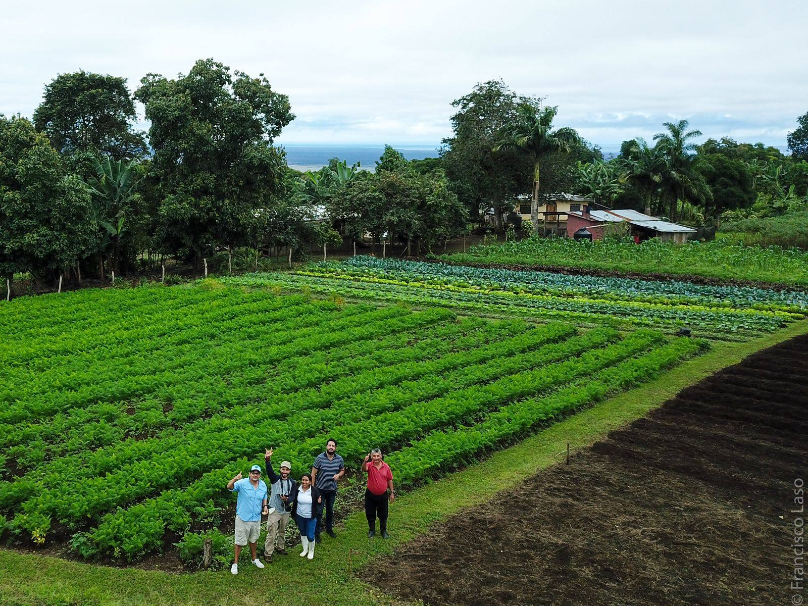
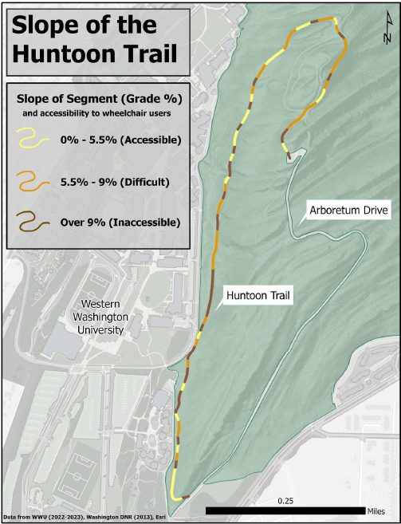
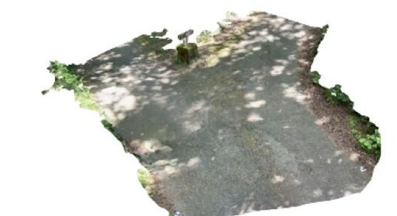
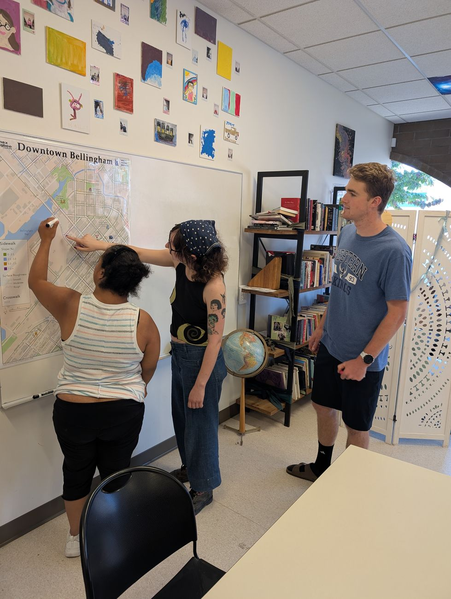

What isn't on the map is easy to ignore. Our work documents what official maps tend to miss — biodiversity on working farms, farmers' knowledge of their land, the barriers disabled people navigate every day — so that it can be recognized and weighed in decisions alongside the views that usually dominate. Grounded in political ecology and human–environment geography, we study how socio-ecological conflicts take shape in space, and how participatory, place-based data can support fairer environmental decisions. We work across disciplines, institutions and communities, and we try to make what we learn useful and readable for the people it concerns.

::: {.project}
## Galapagos Agroecological Observatory {#galapagos-agroecological-observatory}

[Landscape]{.tag}[Spatial observation]{.tag} 2022–present · Galápagos, Ecuador

{.wide-img fig-alt="Aerial view of a green vegetable farm in the Galápagos highlands with people standing at its edge" style="max-height:420px"}

The farming highlands of the Galápagos are central to local food production and to invasive-species management, yet they have long been left out of conservation narratives. The observatory is a long-term socio-ecological monitoring initiative founded with researchers at the Universidad San Francisco de Quito (USFQ) and local stakeholders, bringing scientists, farmers and educators together.

- **Floreana baseline.** The first interdisciplinary fieldwork took place on Floreana in September 2023, ahead of the island's rodent eradication, and was repeated in 2024 — birds, reptiles and insects, soil and water sampling, and drone mapping of land cover.
- **Seeing through the garúa.** Low cloud hides the highlands for much of the year. We evaluate satellite, radar and drone data to design monitoring that works anyway.
- **Open, bilingual tools.** The [Galápagos Agroecosystem Explorer](https://galapagosobservatory.users.earthengine.app/view/galapagos-agroecosystem-explorer) lets anyone browse land-cover maps and satellite imagery in English or Spanish; a WhatsApp community keeps farmers part of the conversation.
- **Data stewardship.** Large drone and satellite datasets are archived in the Galapagos Science Center Dataverse, which Francisco manages.

[Observatory website](https://www.observatoriogalapagos.org){.btn-olive}
:::

::: {.project}
## Mapping Accessibility Project {#mapping-accessibility-project}

[Accessibility]{.tag}[Spatial observation]{.tag} 2023–present · Western Washington University

::: {.figure-row}
{fig-alt="Huntoon Trail map colour-coded by slope: accessible, difficult and inaccessible segments" style="object-position:center top"}

{fig-alt="3D LiDAR scan of a forest trail segment near the fork to the watchtower"}

{fig-alt="Community members adding notes to a printed campus map"}
:::

The Mapping Accessibility Project (MAP) brings together students, faculty, staff and alumni to improve campus accessibility through participatory mapping. It began in 2023 with a WWU Diversity & Social Justice grant and works with the Digital Technologies Accessibility Coordinator and the Disability Outreach Center. Biweekly MAP meetings shape the team projects in GIS IV (ENVS 421).

- **Sehome Hill Arboretum.** Student teams have mapped trail surfaces, slopes, obstacles and points of interest, including LiDAR scans of key segments.
- **Maps beyond the visual.** Because most maps are unusable with a screen reader, students wrote plain-text, step-by-step routes from accessible entrances to accessible parking.
- **Safety and comfort.** Assessments of snow-removal routes, fire-evacuation paths, lifesaving devices, automatic doors, building entrances and sensory spaces.
- **Collaborations across campus**, including sound mapping in the arboretum with Musicology and robotic-wheelchair space assessment with Computer Science.
:::

::: {.project}
## Long-term ecological monitoring of Wreck Bay {#wreck-bay}

[Spatial observation]{.tag} 2025–present · San Cristóbal, Galápagos

As an associated researcher on the *LTER Bahía Naufragio* project, we fly aerial mapping missions for long-term vegetation monitoring of an ecologically sensitive coastline threatened by development.
:::

::: {.project}
## Land use and extraction in Ecuador {#ecuador}

[Landscape]{.tag} Ecuadorian Amazon and Andes

Spatial analysis of hydrocarbon pollution reported through community monitoring in the northern Ecuadorian Amazon (manuscript in preparation), building on earlier modelling of road building, deforestation and carbon emissions at the oil frontier.
:::

::: {.project}
## Human–wildlife conflicts in the Galápagos {#human-wildlife}

[Landscape]{.tag} Edited volume · Springer Nature (expected 2027)

Francisco is co-editing *Human–Wildlife Conflicts in the Galápagos Islands* with M. Giefer, part of the *Social and Ecological Interactions in the Galápagos Islands* series.
:::

## How we work

::: {.themes}
::: {.theme}
### Remote sensing

Landsat, Sentinel-2, Sentinel-1 radar and Dynamic World in Google Earth Engine; supervised classification and change detection.
:::

::: {.theme}
### Drones and terrain data

Multispectral drone flights, ground control and photogrammetry (Agisoft Metashape), plus LiDAR-derived elevation data, for farm-scale and trail-scale maps.
:::

::: {.theme}
### Participatory and qualitative methods

Drone-based participatory mapping, interviews and pile sorts — putting local knowledge on the map.
:::
:::

## Partners

Universidad San Francisco de Quito (Geography Institute) · Galapagos Science Center · Center for Galapagos Studies, UNC Chapel Hill · Heifer Ecuador · Galápagos Ministry of Agriculture · Education 4 Nature Galápagos · ECOS Foundation · Charles Darwin Foundation · WWU Disability Outreach Center · WWU Digital Technologies Accessibility
