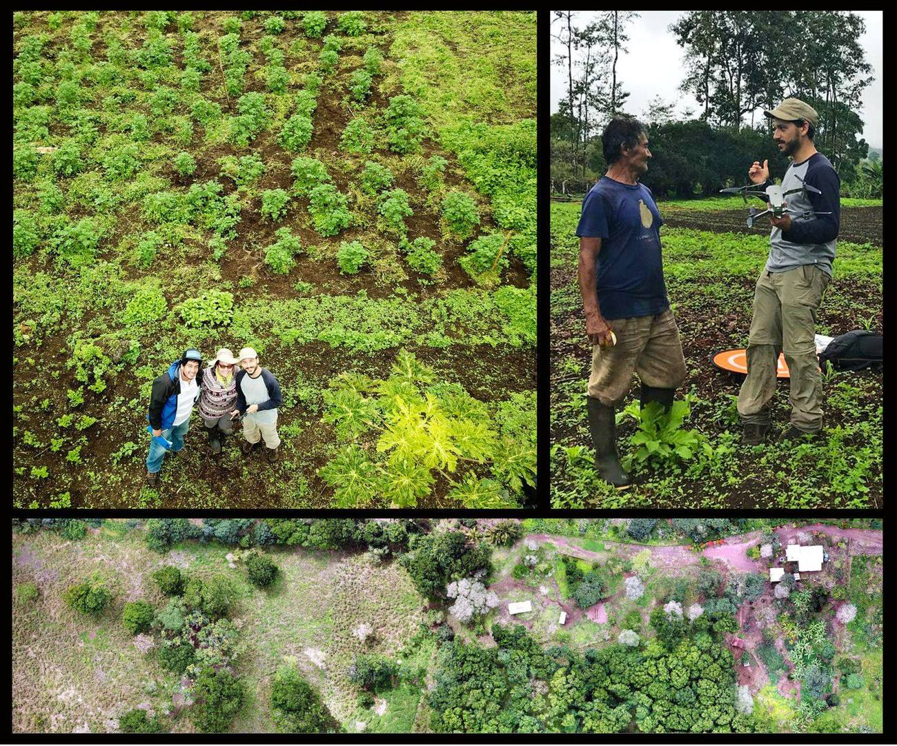

Geography integrates human and environmental dimensions in the analysis of space, and our teaching follows that tradition. Courses use active learning and applied projects: GIS students audit campus accessibility with the Mapping Accessibility Project, and seminar students publish public-facing work on Wikipedia.

## Courses at Western Washington University

**ENVS 320 / 517 — GIS I: Introduction to Geographic Information Science**\
Spatial thinking, data acquisition, spatial analysis and map production in ArcGIS Pro, including data ethics and accessibility-aware mapping.

**ENVS 418 / 518 — GIS II: Cartography and Geovisualization**\
Critical cartography, visual hierarchy, symbolization, typography and colour for static and interactive maps.

**ENVS 421 / 521 — GIS IV: Geospatial Data Creation and Management**\
Capstone, team-based GIS projects with R-based workflows, map digitization and field data collection — with a recurring focus on campus and community accessibility.

**ESCI 442 / 542 — Introduction to Remote Sensing**\
Physical principles of electromagnetic sensing, raster analysis and cloud computing in Google Earth Engine: spectral indices, machine-learning classification and time-series change detection.

**ENVS 401 / 504 — Introduction to Research Methods**\
Qualitative and quantitative research design, proposal writing and statistics in R; graduate students integrate mixed methods.

**ENVS 201 — Understanding and Communicating Environmental Data and Information**\
Data literacy through storytelling, exploration, basic statistics and visualization, ending in an infographic and a flash talk.

**ENVS 334 — Extractivism in Latin America**\
Extractive industries through social, ecological, economic and political lenses, with a Collaborative Online International Learning (COIL) exchange with students in Ecuador and a public Wikipedia contribution.

**Honors College** — *Extractivism and its Alternatives in Latin America* (HNRS 350) and the Ecuador study-abroad course *Navigating the Human Experience: Postmodernity* (HNRS 105).

**Senior projects** — applied, community-engaged research on accessibility, spatial analysis and environmental decision-making.

## Workshops and training

{.wide-img fig-alt="Collage of a drone-mapping workshop with Ministry of Agriculture technicians in Galápagos farm fields" style="max-height:440px"}

Hands-on workshops for the Galápagos Ministry of Agriculture on open-source GIS (2023) and drone mapping — flight planning, ground control and photogrammetry (2024); GIS workshops for environmental educators and youth in the Galápagos; and guest lectures on drones in qualitative research.
